<div align="center">



<br>

# 👋 Hey, I'm Harish

### ☕ Java Learner · 💻 Future C# Developer · 🎮 Game Developer

**Learn → Build → Experiment → Improve**

</div>

---

## 🧑‍💻 `whoami`

```yaml
name: Harish
username: HarishInUtopia

role: Aspiring Software Developer

currently_learning:
  - Java
  - Object-Oriented Programming
  - Problem Solving
  - Software Development

next_up:
  - C#
  - .NET
  - Backend Development

game_development:
  engine: Unity
  interests:
    - Gameplay Programming
    - Game Systems
    - Optimization
    - Creative Experiments

tools:
  - Git
  - GitHub
  - Visual Studio Code
  - IntelliJ IDEA
  - Blender

mindset:
  - Learn by building
  - Experiment often
  - Improve continuously
  - Keep moving forward
```

---

## 🚀 Current Mission

I'm building my programming skills one project at a time.

My current journey starts with **Java**, with the goal of moving toward **C#/.NET** and eventually creating games and interactive experiences with **Unity**.

```text
┌──────────────────────────────────────────────────────────────┐
│                     DEVELOPMENT STATUS                       │
├──────────────────────────────────────────────────────────────┤
│                                                              │
│  Java Fundamentals              ████████████████████░░  90%   │
│  Object-Oriented Programming    ██████████████████░░░  85%   │
│  Problem Solving                ████████████████░░░░░  75%   │
│  Java Projects                  ██████████████░░░░░░░  65%   │
│                                                              │
│  C#                              ██████░░░░░░░░░░░░░░  25%   │
│  .NET                            ██░░░░░░░░░░░░░░░░░░  10%   │
│  Backend Development             ██░░░░░░░░░░░░░░░░░░  10%   │
│  Unity Game Development          ██████░░░░░░░░░░░░░░  25%   │
│                                                              │
└──────────────────────────────────────────────────────────────┘
```

---

## 🛠️ Tech Stack

### 💻 Languages

<p align="center">


</p>

### 🎮 Game Development

<p align="center">


</p>

### 🔧 Tools

<p align="center">


</p>

---

## 🎮 Game Development

One of my long-term goals is to build games and interactive experiences.

```text
                         GAME DEVELOPMENT
                                │
                                ▼
                         ┌────────────┐
                         │     C#     │
                         └─────┬──────┘
                               │
                               ▼
                         ┌────────────┐
                         │   UNITY    │
                         └─────┬──────┘
                               │
              ┌────────────────┼────────────────┐
              │                │                │
              ▼                ▼                ▼
          GAMEPLAY        GAME SYSTEMS     OPTIMIZATION
              │                │                │
              └────────────────┼────────────────┘
                               │
                               ▼
                       CREATIVE PROJECTS
```

---

## 📂 What You'll Find Here

```text
📁 Projects
│
├── ☕ Java Applications
├── 🧩 OOP Experiments
├── 🧠 Problem Solving
├── 🛠️ Developer Utilities
├── 📦 Reusable Code
├── 💻 C# Projects
├── 🎮 Unity Experiments
├── 🌐 Web Experiments
└── 🧪 Random Ideas
```

Some projects will be polished.

Some will probably be messy.

Some will fail.

And that's completely fine.

**Every project is another opportunity to learn something new.**

---

## 🧠 Development Pipeline

```text
                 ┌───────────────┐
                 │     LEARN     │
                 └───────┬───────┘
                         │
                         ▼
                 ┌───────────────┐
                 │    PRACTICE   │
                 └───────┬───────┘
                         │
                         ▼
                 ┌───────────────┐
                 │     BUILD     │
                 └───────┬───────┘
                         │
                         ▼
                 ┌───────────────┐
                 │  EXPERIMENT   │
                 └───────┬───────┘
                         │
                         ▼
                 ┌───────────────┐
                 │     DEBUG     │
                 └───────┬───────┘
                         │
                         ▼
                 ┌───────────────┐
                 │    IMPROVE    │
                 └───────┬───────┘
                         │
                         ▼
                 ┌───────────────┐
                 │     REPEAT    │
                 └───────────────┘
```

---

## 🗺️ Roadmap

```text
JAVA
 │
 ├── Fundamentals
 ├── Object-Oriented Programming
 ├── Problem Solving
 └── Projects
          │
          ▼
        C#
          │
          ├── Language Basics
          ├── OOP
          └── Project Development
          │
          ▼
        .NET
          │
          ├── Backend
          └── Application Development
          │
          ▼
       UNITY
          │
          ├── Gameplay
          ├── Game Systems
          ├── Optimization
          └── Game Projects
          │
          ▼
     OPEN SOURCE
```

### 🎯 Goals

- [x] Learn programming fundamentals
- [x] Start learning Java
- [ ] Strengthen Object-Oriented Programming
- [ ] Build more Java projects
- [ ] Improve problem-solving skills
- [ ] Learn advanced Java
- [ ] Learn C#
- [ ] Explore .NET
- [ ] Learn backend development
- [ ] Build Unity games
- [ ] Learn game optimization
- [ ] Contribute to open source

---

## 🧪 Currently Experimenting With

```text
┌──────────────────────────────────────────────────────────┐
│                    EXPERIMENT LAB                        │
├──────────────────────────────────────────────────────────┤
│                                                          │
│  ☕ Java                  ████████████████░░░             │
│  🧩 OOP                  ██████████████░░░░░             │
│  🧠 Problem Solving      ████████████░░░░░░░             │
│  🎮 Unity                ██████░░░░░░░░░░░░             │
│  💻 C#                   █████░░░░░░░░░░░░░             │
│  🧊 Blender              ████░░░░░░░░░░░░░░             │
│                                                          │
└──────────────────────────────────────────────────────────┘
```

---

## 💡 Developer Mindset

<div align="center">

### Build things.

### Break things.

### Fix things.

### Learn from things.

### Build again.

</div>

```text
$ learn
> knowledge acquired

$ code
> project created

$ debug
> bugs discovered

$ fix
> bugs defeated

$ repeat
> becoming better...
```

---

## 🤝 Let's Connect

I'm always open to learning, sharing ideas, and connecting with other developers.

If you find something interesting in my repositories, feel free to explore the code and share feedback.

Whether it's Java, C#, Unity, game development, or just a random experiment, I'm always trying to build something new.

---

<div align="center">

## ⚡ Keep Learning. Keep Building. Keep Improving.

<br>

> **"Consistency beats perfection. Every line of code is a step forward."**

<br>

`☕ Java` · `💻 C#` · `🎮 Unity` · `🚀 Future Projects`

<br><br>

⭐ **Thanks for visiting my profile!**

</div>
